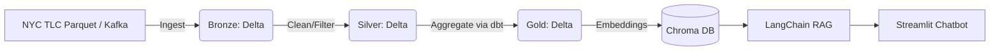

# 🚖 NYC Taxi AI Analytics Lakehouse 

A modern, production-grade Data Lakehouse that ingests NYC Yellow Taxi data, processes it through Medallion Architecture (Bronze -> Silver -> Gold) using **Delta Lake**, orchestrates everything with **Apache Airflow**, models with **dbt**, and exposes the gold layer securely via a natural-language **RAG Chatbot** powered by **LangChain + Chroma**.

## 🏗 Architecture


## 🛠 Tech Stack
- **Languages:** Python 3.11, SQL
- **Processing:** PySpark 3.5.0, Delta Lake 3.2.0
- **Orchestration:** Apache Airflow 2.10.0
- **Streaming:** Apache Kafka
- **Storage:** MinIO (S3-compatible)
- **Transformations:** dbt-core
- **AI/RAG:** LangChain, HuggingFace, ChromaDB, Groq
- **UI:** Streamlit
- **Data Quality:** Great Expectations
- **Infrastructure:** Docker & Docker Compose

## 🚀 Step-by-Step Local Setup

1. **Clone the Repository**
   ```bash
   git clone https://github.com/singhaditya21/NYC-Taxi-AI-Analytics-Lakehouse.git
   cd NYC-Taxi-AI-Analytics-Lakehouse
   ```

2. **Configure Environment**
   ```bash
   cp .env.example .env
   # Add your GROQ_API_KEY into .env
   ```

3. **Start the Infrastructure**
   ```bash
   docker-compose up --build -d
   ```
   This spins up Airflow, MinIO, Kafka, Spark Master, and the Streamlit RAG application.

4. **Run Pipelines**
   - Head to Airflow `http://localhost:8080` (admin/admin), unpause DAGs sequentially: `ingest_bronze`, `process_silver`, `build_gold_dbt`, and `rag_sync`.
   - Monitor job progress in the Airflow UI.
   - Wait for streaming: `python streaming/producer.py` will send mock rides directly into Kafka.

5. **Interact via AI Chatbot**
   - Access the Streamlit RAG UI at `http://localhost:8501`.
   - Ask analytical queries, e.g., "What was the highest fare in January?"

## 📸 Screenshots
*(Placeholder for Streamlit App screenshot)*  
*(Placeholder for Airflow DAGs screenshot)*

## 💡 Learnings & Challenges
- Implementing exactly-once semantics with Kafka + Structured Streaming.
- Keeping Delta Lake optimizations (Z-Ordering, Vacuuming) tuned for interactive Dashboards and RAG vector searches.
- Building stateless LangChain retrievers connected to our live Delta table snapshot.

## 🎯 How this gets you a job in 2026
This portfolio highlights an intersection of **Data Engineering**, **GenAI**, and **Platform Reliability**. Moving beyond simple batch reports, it encompasses modern Data Platform standards like Streaming, Delta Lakehouse architectures, explicit Data Quality (Great Expectations), and tangible AI use cases wrapped in an accessible UI.\n